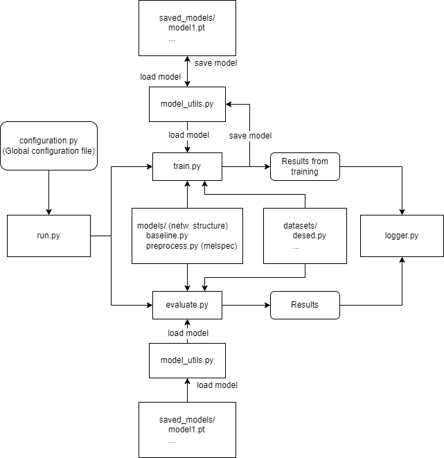

# Thesis Project
An AI and Machine Learning project developed by Mattias Beming and Ludvig Joborn (former students at Linköping University).

The thesis work was conducted during the spring of 2022 in collaboration with The Swedish Police Authority - National Forensic Centre (sv. Polismyndigheten - Nationellt Forensiskt Centrum).

[Insert introduction here]
[TODO: write text about publication]
[Publication](http://liu.diva-portal.org/smash/record.jsf?pid=diva2%3A1688428&dswid=-7955)

## Overview
- [Thesis Project](#thesis-project)
  - [Overview](#overview)
  - [Architecture](#architecture)
  - [Setup](#setup)
  - [Acquire and Build Datasets](#acquire-and-build-datasets)
  - [Run Code](#run-code)

## Architecture
[Insert content here]

## Setup
[Insert content here]
link to file -> [setup.md](docs/setup.md)

## Acquire and Build Datasets
[Insert content here]
link to file -> [datasets.md](docs/datasets.md)

## Run Code
[Insert content here]
link to file -> [run.md](docs/run.md)
