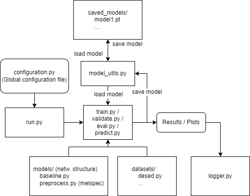

# Thesis Project
An AI and Machine Learning project developed by Mattias Beming and Ludvig Joborn (former students at Linköping University).

The thesis work was conducted during the spring of 2022 in collaboration with The Swedish Police Authority - National Forensic Centre (sv. Polismyndigheten - Nationellt Forensiskt Centrum).

The thesis is mostly concerned with Deep Learning in the context of Voice Activity Detection; that is, using neural networks to find voice activity in audio recordings. It also briefly touches the area of Sound Event Detection. If these areas are of interest to you, feel free to check out our published thesis!

Our thesis has been published at DiVA. You can find the publication [here](http://liu.diva-portal.org/smash/record.jsf?pid=diva2%3A1688428&dswid=-7955).

## Overview
- [Thesis Project](#thesis-project)
  - [Overview](#overview)
  - [Architecture](#architecture)
  - [Setup](#setup)
  - [Acquire and Build Datasets](#acquire-and-build-datasets)
  - [Run Code](#run-code)
  - [Citation](#citation)


## Architecture
A *simplified* image of the project architecture is shown below. Understanding the architecture is not necessary for simple usage, but will hopefully be helpful to anyone that desires to make deeper use of the project material.

Arrows indicate code-wise dependencies. 

**Note**: `evaluate.py` has been split up into `validate.py`, `eval.py` and `predict.py`, but they all fit where `evaluate.py` is currently placed.




## Setup
Instructions for setting up the project is found in [setup.md](docs/setup.md).

## Acquire and Build Datasets
The instructions on how to download the datasets used is found in [datasets.md](docs/datasets.md).

## Run Code
Instructions to run code can be found in [run.md](docs/run.md).

## Citation

If you find the code useful in your projects or research, consider citing our thesis:
```bibtex
@mastersthesis{Joborn-Beming,
   author = {Joborn, Ludvig and Beming, Mattias},
   institution = {Linköping University, Department of Computer and Information Science},
   pages = {68},
   school = {Linköping University, Department of Computer and Information Science},
   title = {Towards a Nuanced Evaluation of Voice Activity Detection Systems : An Examination of Metrics, Sampling Rates and Noise with Deep Learning},
   year = {2022}
}
```